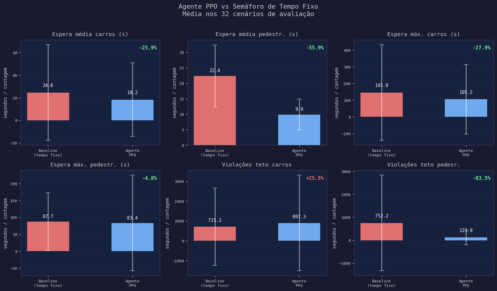
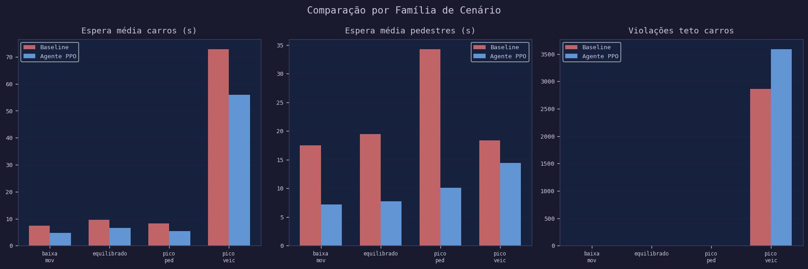
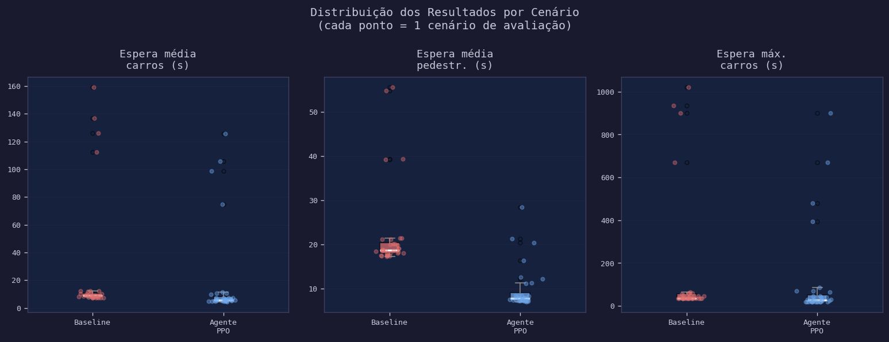
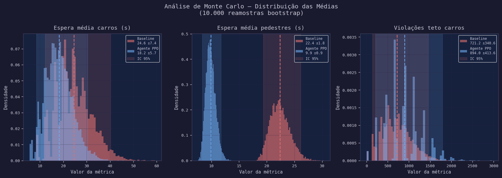
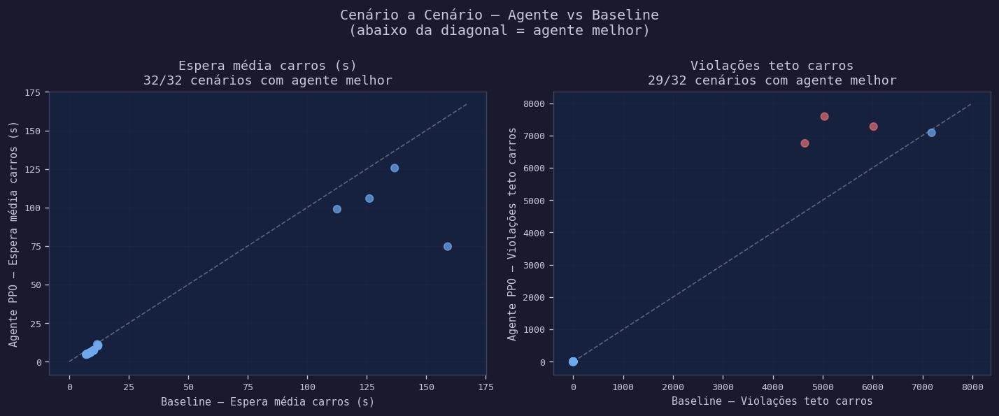

# Relatório de Análise — Semáforo Inteligente

> **Agente:** PPO (Stable-Baselines3)  
> **Cenários de avaliação:** 32  
> **Benchmark:** Semáforo de tempo fixo (Fase A=45s / Fase B=25s)  
> **Tetos:** carros ≤ 90s | pedestres ≤ 60s  

---

## 1. Comparação Geral

| Métrica | Baseline | Agente PPO | Variação |
|---|---:|---:|---:|
| ✅ Espera média
carros (s) | 24.6 | 18.2 | -25.9% |
| ✅ Espera média
pedestr. (s) | 22.4 | 9.9 | -55.9% |
| ✅ Espera máx.
carros (s) | 145.9 | 105.2 | -27.9% |
| ✅ Espera máx.
pedestr. (s) | 87.7 | 83.4 | -4.8% |
| ❌ Violações
teto carros | 715.2 | 897.3 | +25.5% |
| ✅ Violações
teto pedesr. | 752.2 | 123.9 | -83.5% |

---

## 2. Comparação por Família de Cenário

### Espera média — carros

| Família | Baseline | Agente PPO | Variação |
|---|---:|---:|---:|
| baixa_mov | 7.5 | 4.8 | -35.4% |
| equilibrado | 9.7 | 6.6 | -31.4% |
| pico_ped | 8.3 | 5.5 | -34.4% |
| pico_veic | 72.9 | 55.9 | -23.2% |

### Espera média — pedestres

| Família | Baseline | Agente PPO | Variação |
|---|---:|---:|---:|
| baixa_mov | 17.5 | 7.2 | -58.7% |
| equilibrado | 19.5 | 7.7 | -60.3% |
| pico_ped | 34.3 | 10.1 | -70.6% |
| pico_veic | 18.3 | 14.5 | -21.1% |

---

## 3. Distribuição dos Resultados

O boxplot abaixo mostra a variabilidade dos resultados entre os 32 cenários:

---

## 4. Análise de Monte Carlo

Reamostragem bootstrap com 10.000 iterações para estimativa robusta dos intervalos de confiança:

| Métrica | Baseline média | IC 95% | Agente média | IC 95% | p-valor |
|---|---:|---|---:|---|---:|
| Espera média carros (s) | 24.6 | [12.3, 40.7] | 18.2 | [8.8, 30.4] | ❌ ≥0.05 |
| Espera média pedestr. (s) | 22.4 | [19.4, 26.1] | 9.9 | [8.4, 11.8] | ✅ <0.05 |
| Espera máx. carros (s) | 145.8 | [61.7, 254.7] | 105.4 | [43.8, 183.6] | ❌ ≥0.05 |
| Espera máx. pedestr. (s) | 87.7 | [62.3, 119.4] | 83.6 | [41.9, 136.1] | ❌ ≥0.05 |

---

## 5. Análise Cenário a Cenário

Cada ponto representa um cenário de avaliação. Pontos abaixo da diagonal indicam que o agente foi melhor que o baseline naquele cenário específico:

---

## 6. Conclusão

O agente PPO demonstrou comportamento **assimétrico**: reduziu significativamente o tempo de espera de pedestres mas aumentou o de carros. Isso indica que a função de recompensa precisa de melhor calibração do peso de equilíbrio entre as duas filas.

*Gerado automaticamente por scripts/analyze_results.py*
